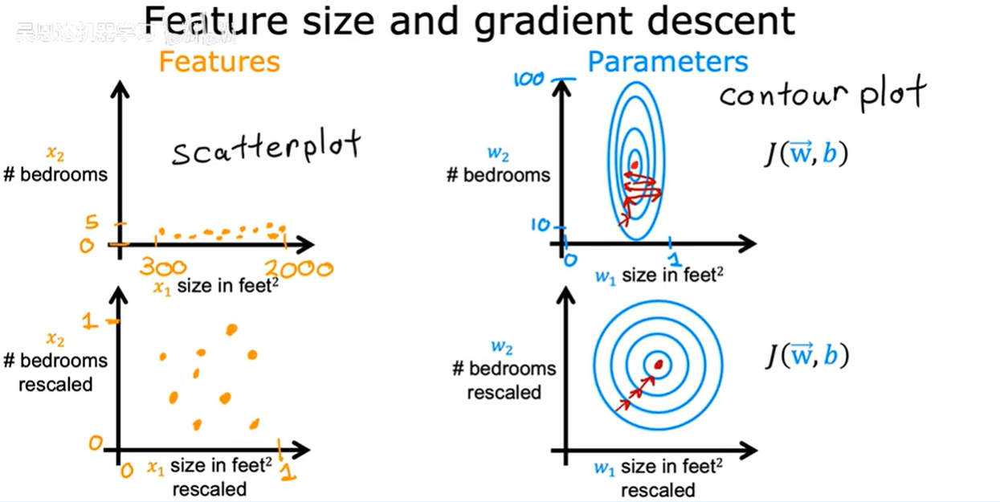

# 基础 内容

## 线性回归模型

构建线性回归模型，可以用直线去拟合数据之间的关系

线性回归模型是一种特殊的监督学习，线性模型是回归模型的一种。

### 训练集标准符号

输入的标准符号：$x$

输出变量（实际值）：$y$

输出预测（估计值）：$\hat{y}$

数据训练总数：$m$

训练实例：$(x,y)$

不同的训练示例：$(x^{(i)},y^{(j)})$

### 线性回归函数

$$
f(x) = wx+b
$$

$w,b$为函数的系数或权重，不同的$w，b$带来不同的线性函数。

$x^{(i)}$对应的预测值$\hat{y}^{(i)} = f(x^{(i)})$

### 成本函数

误差：$(\hat{y}-y)$

计算平均平方误差以避免成本函数随着训练集的变大而自动变大，即**均方误差**

在线性回归中，**最常用的损失函数是均方误差 ($MSE$)** ，它衡量了模型预测值与真实值之间的平方差:

$$
MSE=\frac{1}{m} \sum\limits_{i=1}^m{(y_i -\hat{y_i})^2}
$$

为了后续计算方便整洁：$J(w,b)=MSE=\frac{1}{2m} \sum\limits_{i=1}^m{(y_i -\hat{y_i})^2}$

其中$m$是样本数量，$y_i$是第$i$个样本的真实值，$\hat{y_i}$是模型对第$i$个样本的预测值

**PS：**

①损失函数衡量的是**单个训练样本**的预测结果与实际标签之间的误差。换句话说，它计算模型对一个样本的预测与实际结果之间的差距。

②成本函数是对**整个训练集**的损失的聚合度量。通常是所有样本损失的平均值或总和。它反映的是模型在整个训练集上的表现。

### 寻找最合适的成本函数

$f_{w,b}(x) = wx+b$

$J(w,b)=\frac{1}{2m} \sum\limits_{i=1}^m{(f(x^{(i)}-\hat{y}^{(i)})^2}$

即寻找合适的$w，b$使$J$的值最小。

#### 令b=0

根据不同的$w$值可以绘制出$J(w)$于$w$的关系,可以找到最小的$J(w)$

#### 令b≠0

可视化关系图belike：

将三维图转化为二维平面图去考虑，采用等高线绘图法，看不同的$w$和$b$对成本函数的影响

为了寻找到最小值，我们采用**梯度下降算法**

### 梯度下降算法

梯度下降的基本思想**：从一个随机的起始点开始，**沿着负梯度方向（导数值最小的方向）逐步迭代更新参数，直到达到损失函数的最小值。

####实现梯度下降

学习率$\alpha$通常使0~1间的小数,

$w=w-\alpha \frac{\partial}{\partial w} J(w, b)$

$b=b-\alpha \frac{\partial}{\partial w} J(w, b)$

在程序中同时更新两个参数$w,b$,需要**注意赋值顺序**

$twp\underline{}w=w-\alpha \frac{\partial}{\partial w} J(w, b)$

$twp\underline{}b=b-\alpha \frac{\partial}{\partial w} J(w, b)$

$w=twp\underline{}w$

 $b=twp\underline{}b$

 **导数推导**

**偏导数部分即为斜率**，在$J(w)$最小值的两侧偏导数的正负保证了$w$的值在更新后是**在朝着$w_{min}$移动**

#### 学习率

如果学习率$\alpha$太小→梯度下降太慢，即**收敛速度会变慢**。

学习率太大→梯度下降过冲可能到达不了最小值，即**参数振荡、发散**

 **当成本函数有多个局部最小值时**：

当到达局部最小值时，$\frac{d}{dw}J(w)=0$

**当我们接近局部最小值时，步长会越来越短，最后趋近去局部最小值**

#### 线性回归梯度下降算法

## 多类特征

###模型函数：
$f_{w,b}(x)=w_1x_1+2_2x_2+...+w_nx_n+b$

行向量$\vec{w}=[w_1 w_2...w_n]$

特征向量$\vec{x}=[x_1x_2...x_n]$

则有$f_{\vec{w},b} (x)=\vec{w}\cdot\vec{x}+b==w_1x_1+2_2x_2+...+w_nx_n+b $

###向量化：

## 特征缩放

 

当有不同可能值的特征向量时，可能会使梯度下降速度变慢，所以进行特征缩放时可以显著加快梯度下降的速度。

### 如何合适的缩放

可以**除以范围内最大值**，可以做**均值归一化（Mean Normalization）**，还可以做**Z分数归一化（Z-score normalization）**。

**均值归一化：**

首先寻找训练集平均值$\mu_1$,则$x_1$缩放为$x_1=\frac{x_1-\mu_1}{max-min}$

**Z分数归一化：**

计算每个特征训练集的平均值$\mu_1$和标准差$\sigma_1$,则$x_1$缩放为$x_1=\frac{x_1-\mu_1}{\sigma_1}$

**进行特征缩放的情况**

特征值范围过大或过小，提升梯度下降的速度和有效性

****

###检查梯度下降是否收敛

梯度下降的关键在于学习率的选择，随着迭代次数的提升，成本函数的值越小，可以绘制出学习曲线：

当迭代次数达到300次后，曲线趋近于平缓，此时接近于成本函数最小值。可以通过设置一个阈值$\epsilon$，$\epsilon$是一个很小的正数，当$J(\vec{w},b)<\epsilon$时，此时收敛达到最小值。

如果曲线发生上升趋势，则说明学习率选择过大，梯度下降无法收敛。

### 如何选择学习率

从特别小的学习率开始

### 特征工程

创建一个新特性可以使预测更加准确、

## 逻辑回归

###分类

只有两种预测可能性的称为**二分类**

 

### 分类算法—逻辑回归

**Sigmoid函数（激活函数）**

**利用激活函数构造逻辑函数**

### 决策边界

不同的逻辑函数及其参数$w,b$会有不同的决策边界，位于决策边界的两侧可以预测为积极or消极事件。

### 成本函数

线性回归模型使用**均方误差函数**作为损失函数，使成本函数与参数$w,b$间的关系为**凸函数（convex）**，可以进行梯度下降，而对于逻辑函数，用均方误差函数后，成本函数与参数$w,b$之间的关系为非凸函数（non-convex），含有多个局部最小值，不能进行梯度下降。

**逻辑回归的损失函数**
$$
L(f_{\vec{w},b}(\vec{x}^{(i)},y^{(i)}))=
\begin{cases}
-log(f_{\vec{w},b}(\vec{x}^{(i)})) & \text{if } y^{(i)} = 1 \\
-log(1 - f_{\vec{w},b}(\vec{x}^{(i)})) & \text{if } y^{(i)} = 0
\end{cases}
$$

当$y^{(i)} = 1$时，$f_{\vec{w},b}(\vec{x}^{(i)})$即可能性越接近1，损失函数越接近于0

当$y^{(i)} = 0$时，$f_{\vec{w},b}(\vec{x}^{(i)})$即可能性越接近0，损失函数越接近于0

**逻辑回归的成本函数**
$$
J(\vec{w},b)=\frac{1}{m}\sum\limits_{i=1}^m{L(f_{\vec{w},b}(\vec{x}^{(i)},y^{(i)}))}
$$

**简化损失函数**
$$
L(f_{\vec{w},b}(\vec{x}^{(i)},y^{(i)}))=-y^{(i)}log(f_{\vec{w},b}(\vec{x}^{(i)}))-(1-y^{(i)})log(1 - f_{\vec{w},b}(\vec{x}^{(i)}))
$$

**简化成本函数**
$$
J(\vec{w},b)=\frac{1}{m}\sum\limits_{i=1}^m{}L(f_{\vec{w},b}(\vec{x}^{(i)},y^{(i)}))\\
=-\frac{1}{m}\sum\limits_{i=1}^m{(y^{(i)}log(f_{\vec{w},b}(\vec{x}^{(i)}))+(1-y^{(i)})log(1 - f_{\vec{w},b}(\vec{x}^{(i)})))}
$$

## 梯度下降的实现

