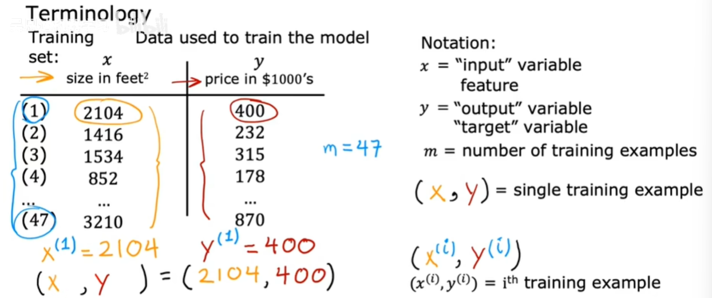
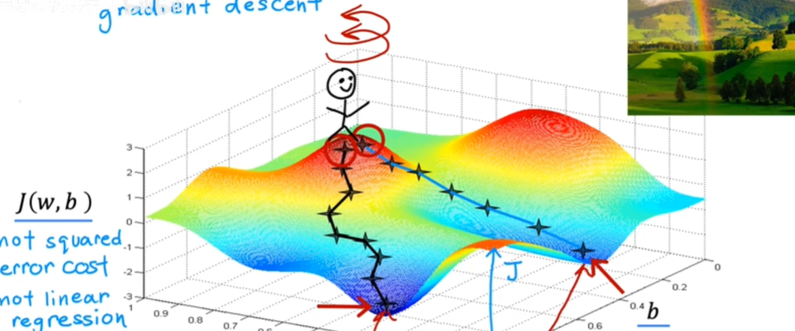
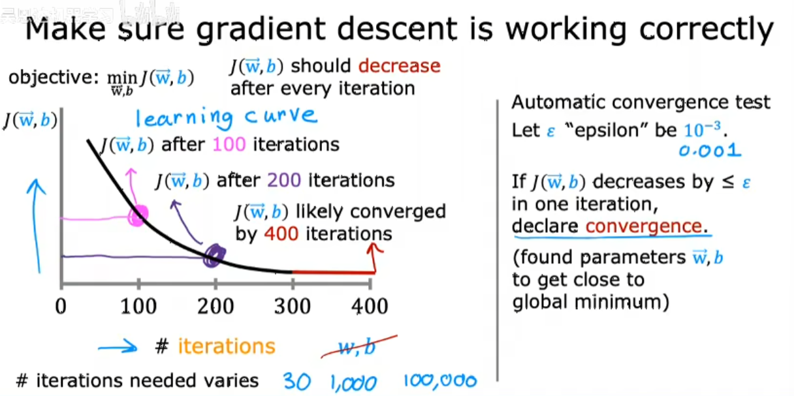
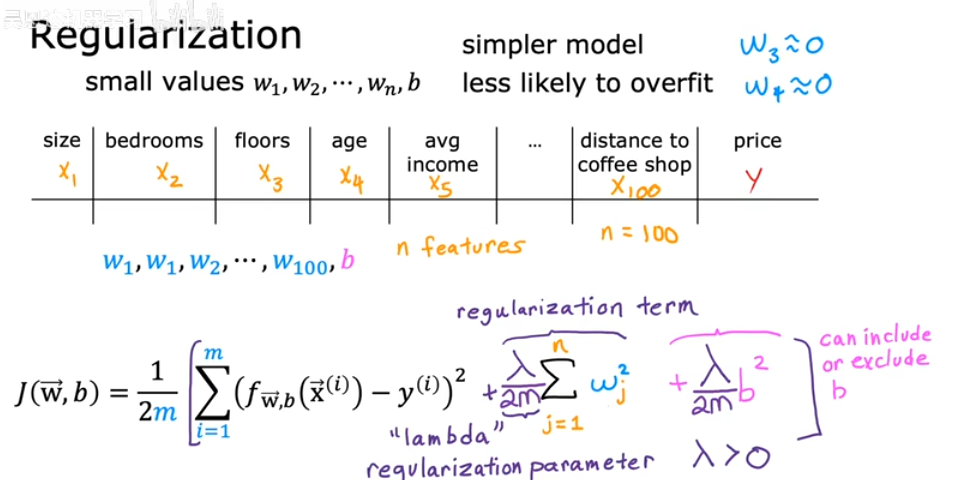

#基础内容

## 线性回归模型

构建线性回归模型，可以用直线去拟合数据之间的关系


线性回归模型是一种特殊的监督学习，线性模型是回归模型的一种。

### 训练集标准符号

输入的标准符号： $x$

输出变量（实际值）： $y$

输出预测（估计值）： $\hat{y}$

数据训练总数： $m$

训练实例： $(x,y)$

不同的训练示例： $(x^{(i)},y^{(j)})$



### 线性回归函数

$$
f(x) = wx+b
$$


 $w,b$为函数的系数或权重，不同的$w，b$带来不同的线性函数。

 $x^{(i)}$对应的预测值$\hat{y}^{(i)} = f(x^{(i)})$

### 成本函数 


误差： $(\hat{y}-y)$

计算平均平方误差以避免成本函数随着训练集的变大而自动变大，即**均方误差**

在线性回归中，**最常用的损失函数是均方误差 ($MSE$)** ，它衡量了模型预测值与真实值之间的平方差:


$$
MSE=\frac{1}{m} \sum\limits_{i=1}^m{(y_i -\hat{y_i})^2}
$$
为了后续计算方便整洁： $J(w,b)=MSE=\frac{1}{2m} \sum\limits_{i=1}^m{(y_i -\hat{y_i})^2}$

其中$m$是样本数量，$y_i$是第$i$个样本的真实值，$\hat{y_i}$是模型对第$i$个样本的预测值

**PS：**

①损失函数衡量的是**单个训练样本**的预测结果与实际标签之间的误差。换句话说，它计算模型对一个样本的预测与实际结果之间的差距。

②成本函数是对**整个训练集**的损失的聚合度量。通常是所有样本损失的平均值或总和。它反映的是模型在整个训练集上的表现。


### 寻找最合适的成本函数

 $f_{w,b}(x) = wx+b$

 $J(w,b)=\frac{1}{2m} \sum\limits_{i=1}^m{(f(x^{(i)}-\hat{y}^{(i)})^2}$

即寻找合适的 $w，b$使$J$的值最小。

#### 令b=0

根据不同的$w$值可以绘制出 $J(w)$于 $w$的关系,可以找到最小的 $J(w)$


#### 令b≠0

可视化关系图belike：


将三维图转化为二维平面图去考虑，采用等高线绘图法，看不同的 $w$和 $b$对成本函数的影响


为了寻找到最小值，我们采用**梯度下降算法**

### 梯度下降算法

梯度下降的基本思想**：从一个随机的起始点开始，**沿着负梯度方向（导数值最小的方向）逐步迭代更新参数，直到达到损失函数的最小值。




####实现梯度下降

学习率$\alpha$通常使0~1间的小数,

 $w=w-\alpha \frac{\partial}{\partial w} J(w, b)$

 $b=b-\alpha \frac{\partial}{\partial w} J(w, b)$

在程序中同时更新两个参数$w,b$,需要**注意赋值顺序**

 $twp\underline{}w=w-\alpha \frac{\partial}{\partial w} J(w, b)$

 $twp\underline{}b=b-\alpha \frac{\partial}{\partial w} J(w, b)$

 $w=twp\underline{}w$

  $b=twp\underline{}b$

 **导数推导**

**偏导数部分即为斜率**，在 $J(w)$最小值的两侧偏导数的正负保证了 $w$的值在更新后是**在朝着 $w_{min}$移动**


#### 学习率

如果学习率 $\alpha$太小→梯度下降太慢，即**收敛速度会变慢**。

学习率太大→梯度下降过冲可能到达不了最小值，即**参数振荡、发散**


 **当成本函数有多个局部最小值时**：

当到达局部最小值时， $\frac{d}{dw}J(w)=0$


**当我们接近局部最小值时，步长会越来越短，最后趋近去局部最小值**


#### 线性回归梯度下降算法


## 多类特征


###模型函数：
 $f_{w,b}(x)=w_1x_1+2_2x_2+...+w_nx_n+b$

行向量 $\vec{w}=[w_1 w_2...w_n]$

特征向量 $\vec{x}=[x_1x_2...x_n]$

则有 $f_{\vec{w},b} (x)=\vec{w}\cdot\vec{x}+b==w_1x_1+2_2x_2+...+w_nx_n+b $

###向量化：


## 特征缩放


当有不同可能值的特征向量时，可能会使梯度下降速度变慢，所以进行特征缩放时可以显著加快梯度下降的速度。

### 如何合适的缩放

可以**除以范围内最大值**，可以做**均值归一化（Mean Normalization）**，还可以做**Z分数归一化（Z-score normalization）**。

**均值归一化：**

首先寻找训练集平均值$\mu_1$,则$x_1$缩放为$x_1=\frac{x_1-\mu_1}{max-min}$


**Z分数归一化：**

计算每个特征训练集的平均值 $\mu_1$和标准差 $\sigma_1$,则 $x_1$缩放为 $x_1=\frac{x_1-\mu_1}{\sigma_1}$


**进行特征缩放的情况**

特征值范围过大或过小，提升梯度下降的速度和有效性


###检查梯度下降是否收敛

梯度下降的关键在于学习率的选择，随着迭代次数的提升，成本函数的值越小，可以绘制出学习曲线：



当迭代次数达到300次后，曲线趋近于平缓，此时接近于成本函数最小值。可以通过设置一个阈值 $\epsilon$， $\epsilon$是一个很小的正数，当 $J(\vec{w},b)<\epsilon$时，此时收敛达到最小值。

如果曲线发生上升趋势，则说明学习率选择过大，梯度下降无法收敛。

### 如何选择学习率

从特别小的学习率开始


### 特征工程

创建一个新特性可以使预测更加准确、


## 逻辑回归

###分类

只有两种预测可能性的称为**二分类**


 

### 分类算法—逻辑回归

**Sigmoid函数（激活函数）**


**利用激活函数构造逻辑函数**


### 决策边界

不同的逻辑函数及其参数 $w,b$会有不同的决策边界，位于决策边界的两侧可以预测为积极or消极事件。


### 成本函数

线性回归模型使用**均方误差函数**作为损失函数，使成本函数与参数 $w,b$间的关系为**凸函数（convex）**，可以进行梯度下降，而对于逻辑函数，用均方误差函数后，成本函数与参数 $w,b$之间的关系为非凸函数（non-convex），含有多个局部最小值，不能进行梯度下降。


**逻辑回归的损失函数**

$$
L(f_{\vec{w},b}(\vec{x}^{(i)},y^{(i)}))=
\begin{cases}
-log(f_{\vec{w},b}(\vec{x}^{(i)})) & \text{if } y^{(i)} = 1 \\
-log(1 - f_{\vec{w},b}(\vec{x}^{(i)})) & \text{if } y^{(i)} = 0
\end{cases}
$$


当 $y^{(i)} = 1$时， $f_{\vec{w},b}(\vec{x}^{(i)})$即可能性越接近1，损失函数越接近于0


当 $y^{(i)} = 0$时， $f_{\vec{w},b}(\vec{x}^{(i)})$即可能性越接近0，损失函数越接近于0


**逻辑回归的成本函数**


$$
J(\vec{w},b)=\frac{1}{m}\sum\limits_{i=1}^m{L(f_{\vec{w},b}(\vec{x}^{(i)},y^{(i)}))}
$$

**简化损失函数**


$$
L(f_{\vec{w},b}(\vec{x}^{(i)},y^{(i)}))=-y^{(i)}log(f_{\vec{w},b}(\vec{x}^{(i)}))-(1-y^{(i)})log(1 - f_{\vec{w},b}(\vec{x}^{(i)}))
$$

**简化成本函数**

$$
J(\vec{w},b)=\frac{1}{m}\sum\limits_{i=1}^m{}L(f_{\vec{w},b}(\vec{x}^{(i)},y^{(i)}))\\
=-\frac{1}{m}\sum\limits_{i=1}^m{(y^{(i)}log(f_{\vec{w},b}(\vec{x}^{(i)}))+(1-y^{(i)})log(1 - f_{\vec{w},b}(\vec{x}^{(i)})))}
$$

###梯度下降的实现

如下图所示更新参数 $w,b$


## 过拟合

**Overfitting** : If we have too many features, the learned hypothesis may fit the training set vey well, but fail to generalize to new examples.

**过度拟合**：如果我们拥有太多的特征，那么学习得到的假设函数可能会过于贴合训练集，但其在对新样本进行泛化时却表现不佳。

其中的'fit the training set very well'的数学语言是：


$$
J_{(w,b)}=\frac{1}{2m}\sum\limits_{i=1}^m{(f_{w,b}(x^{(i)})-y^{(i)})^2\approx0(or =0)}
$$
即函数符合所有的训练集样本导致没有误差，即成本函数为0。

最左侧为**欠 拟合**，最右侧为**过拟合（高方差）**。


### 解决过拟合

①收集更多的数据添加到训练集。

②**特征选择**：目标是**寻找最优特征子集**。特征选择能剔除不相关(irrelevant)或冗余(redundant )的特征，从而达到减少特征个数，**提高模型精确度**。

③利用**正则化**缩小参数 $w_j$（特征缩减）

### 正则化

#### 正则项

我们对成本函数增加一个限制条件，**限制其较高次的参数大小不能过大**。还是使用回归模型举例子：


正是那些高次项导致了过拟合的产生，所以如果我们能让这些高次项的系数接近于0的话，我们就能很好的拟合了，因此，我们对成本函数进行修改：




$$
J(\vec{w},b)=\frac{1}{2m}[\sum\limits_{i=1}^m{(f_{\vec{w},b}(\vec{x}^{(i)})-y^{(i)})^2}+\frac{\lambda}{2m}\sum\limits_{j=1}^n{w_{j}^2}+\frac{\lambda}{2m}\sum\limits_{j=1}^n{b^2}]\\

or\\

J(\vec{w},b)=\frac{1}{2m}[\sum\limits_{i=1}^m{(f_{\vec{w},b}(\vec{x}^{(i)})-y^{(i)})^2}+\frac{\lambda}{2m}\sum\limits_{j=1}^n{w_{j}^2}]
$$
其中  $\lambda$称为**正则化参数**（Regularization Parameter），当参数越大，则对其惩罚（规范）的力度也就越大，越能起到规范的作用。但是要注意，  $\lambda$并不是越大越好的！如果选择的正则化参数过大，则会把所有的参数都最小化了，造成欠拟合。


#### 正则化线性回归


对 $w_{j}$化简可得：

$$
w_{j}=w_{j}-\alpha\frac{\lambda}{2m}w_{j}-\alpha\frac{1}{m}\sum\limits_{i=1}^m{(f_{\vec{w},b}(\vec{x}^{(i)})-y^{(i)})}x_{j}^{(i)}\\
=w_{j}(1-\alpha\frac{\lambda}{2m})-\alpha\frac{1}{m}\sum\limits_{i=1}^m{(f_{\vec{w},b}(\vec{x}^{(i)})-y^{(i)})}x_{j}^{(i)}
$$
此时 $w_j$所乘的不是 $1$，而是 $(1-\alpha\frac{\lambda}{2m})$，是一个小于 $1$的项，这一项的作用为使得每一次梯度下降的迭代中使 $w_	j$变小，故实现了**参数缩减**。

#### 正则化逻辑回归


$$
J(\vec{w},b)=
-\frac{1}{m}\sum\limits_{i=1}^m{(y^{(i)}log(f_{\vec{w},b}(\vec{x}^{(i)}))+(1-y^{(i)})log(1 - f_{\vec{w},b}(\vec{x}^{(i)})))}+\frac{\lambda}{2m}\sum\limits_{j=1}^n{w_j^2}
$$


 

# 高级算法

## 人工神经网络

神经网络可以分为三层：输入层、隐藏层、输出层。输入层向隐藏层传递**特征向量** $\vec{x}$，隐藏层向输出层传递激活向量  $\vec{a}$，最后用输出层输出结果。层内可以有若干个神经元。


隐藏层可以有多层：


### 神经层工作

以单层隐藏层为例，将隐藏层放大，三个神经元对应三种逻辑归回函数，计算得出激活向量 $\vec{a}$，同时用上标方括号表示为第几层隐藏层的输出


激活功能： $g(z)$函数


计算每层的激活值计算：

$$
a_j^{[l]}=g(z)=g(\vec{w}_j^{[l]}\cdot\vec{a}^{[l-1]}+b_j^{[l]})
$$


从左向右进行激活计算为前向传播，反之为反向传播：


## 训练神经网络

训练一个逻辑回归模型

**①**指定如何计算并给出参数值 $w,b$

```python
z = np.dot(w,x)+ b
f_x = 1/(1+np.exp(-z))
```


**②**确定损失和成本函数

```python
loss = -y*np.log(f_x)-(1-y)*np.log(1-f_x)
```

分类模型的损失函数在TensorFlow中称为**二元交叉熵函数:** BinaryCrossentropy

$$
L(f_{\vec{w},b}(\vec{x}^{(i)},y^{(i)}))=-y^{(i)}log(f_{\vec{w},b}(\vec{x}^{(i)}))-(1-y^{(i)})log(1 - f_{\vec{w},b}(\vec{x}^{(i)}))
$$
回归模型的损失函数在TensorFlow中称为**均方误差函数:** MeanSquareError


**③**使用算法，例如梯度下降算法使成本函数最小

```python
w = w-alpha*dj_dw
b = b-alpha*dj_db
```


epochs为迭代次数。


## 新的激活函数

### 常用的激活函数

 sigmoid函数适用于预测二元的情况，其输出值范围为[0,1]，对于大输出值的情况就不太适用。

**ReLU函数**


### 选择激活函数

可以为不同的神经元选择不用的激活函数，选取输出层的激活函数时往往取决于输出结果。二元分类问题——sigmoid函数；回归问题——Linear activation function 、 ReLU。

**sigmoid和ReLU的对比：**
①sigmoid函数需要进行指数运算，效率太低；而ReLU函数计算更快效率更高。

②sigmoid函数有两处较为平坦的地方，影响梯度下降的速度；而ReLU只有左侧时完全平坦的，梯度下降很快。


**选择激活函数**

**隐藏层：**

线性激活函数、ReLU函数。

**常见的经验法则：** 隐藏层中不用线性激活函数，而是用ReLU函数。

**输出层：**

sigmoid函数（二分交叉熵函数）。


### 为什么需要激活函数


